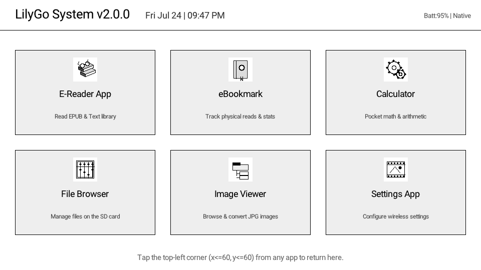

# Chapter 3: Launcher Home Screen

> **App Version**: v2.2.0  
> **Firmware Version**: v2.2.0  
> **Last Verified**: 2026-07-24  

---

## Overview
The **Launcher** serves as the system home screen for the LilyGo EPD47 E-Reader. It displays real-time battery status, date/time, system memory, and a $3 \times 2$ grid of application shortcuts featuring custom 4-bit 16-level grayscale packed icons.

---

## Screen Features & Breakdown

### 1. Top Status Bar
- **System Identifier**: Displays `LilyGo System v2.2.0`.
- **Real-time Clock & Date**: Formatted as `Day Month Date | Hour:Minute AM/PM` (updates automatically every minute).
- **Battery & RAM Metrics**: Monitors live LiPo battery percentage (`Batt:XX%`) and available internal heap (`Heap:XXKB` on hardware or `Native` on desktop simulator).

---

### 2. $3 \times 2$ Application Card Grid

Each shortcut card measures $280 \times 170\text{ pixels}$ and features a custom $48 \times 48$ 4-bit grayscale icon loaded from `/sd/data/app_icons.bin`:

| App Shortcut | Grid Position | Icon Description | Description Text |
| :--- | :--- | :--- | :--- |
| **E-Reader App** | Row 0, Col 0 ($x=30, y=100$) | 3D Stack of Novels with Reading Glasses | Read EPUB & Text library |
| **eBookmark** | Row 0, Col 1 ($x=340, y=100$) | Leather Journal with Ribbon & Star | Track physical reads & stats |
| **Calculator** | Row 0, Col 2 ($x=650, y=100$) | Classic Abacus Bead Frame | Pocket math & arithmetic |
| **File Browser** | Row 1, Col 0 ($x=30, y=300$) | Hierarchical Tree Directory | Manage files on the SD card |
| **Image Viewer** | Row 1, Col 1 ($x=340, y=300$) | Photographic Film Strip & Mountain | Browse & convert JPG images |
| **Settings App** | Row 1, Col 2 ($x=650, y=300$) | Dual Interlocking Gears | Configure wireless settings |

---

## Navigation & Gestures

- **Launch Application**: Tap anywhere inside an app's card box to launch it.
- **Global Return Gesture**: Tapping the **top-left corner** of the screen ($x \le 60, y \le 60$) from any active application instantly returns to this Launcher screen.
